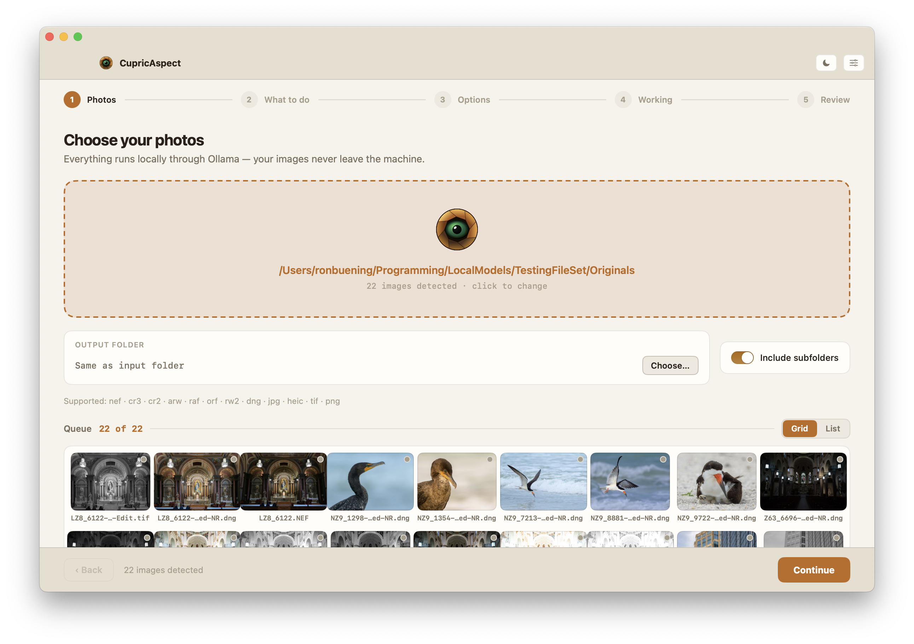
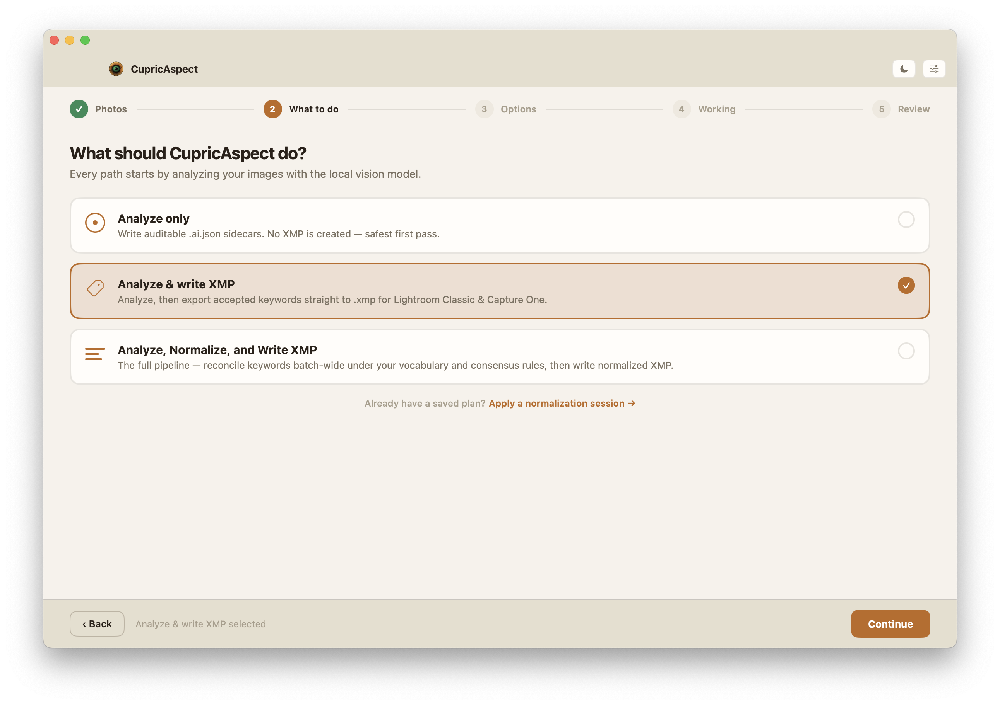
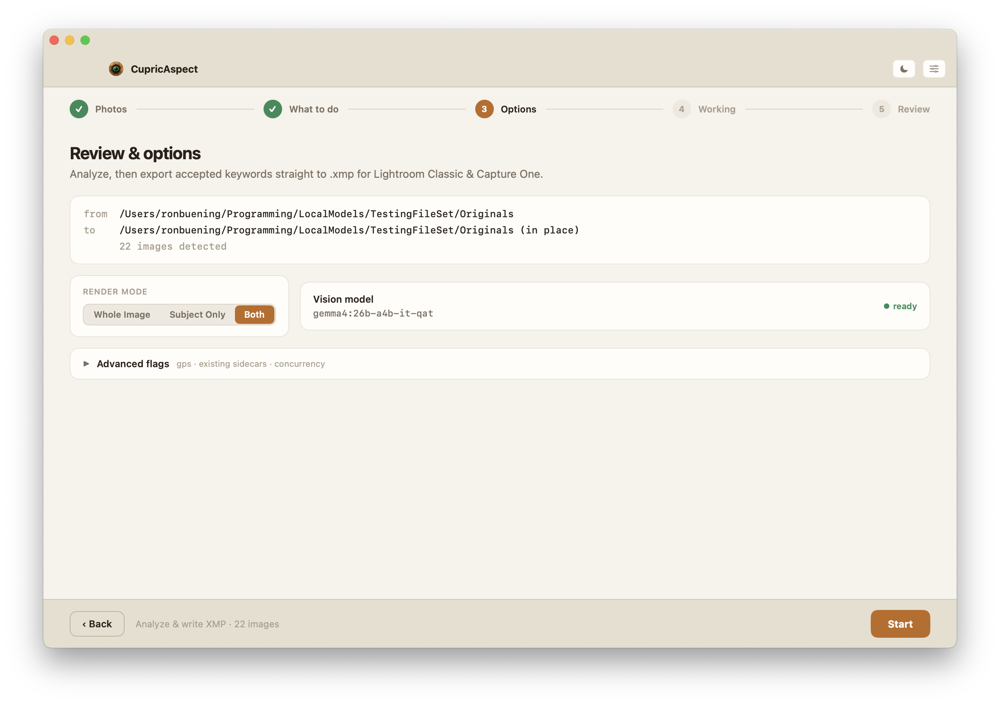
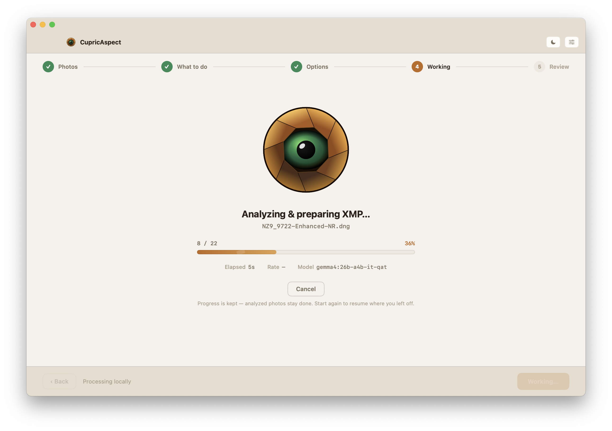
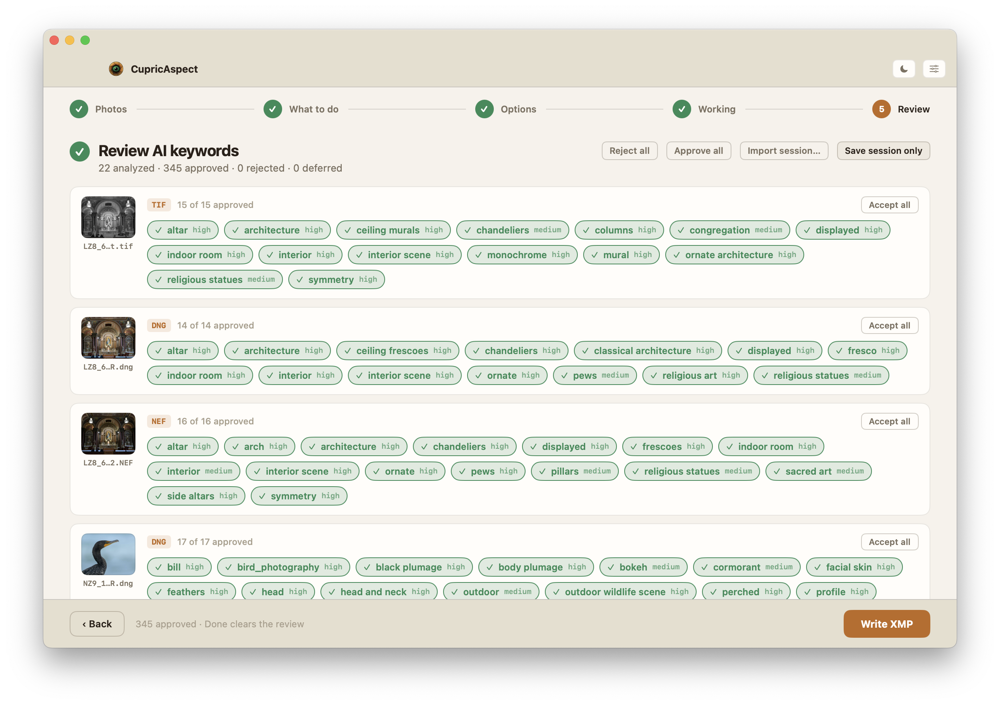

# CameraVision

**Local-first, AI-assisted photo keyword tagging for macOS.**

CameraVision analyzes your photos with a local vision model and writes clean,
reviewable keyword metadata to XMP sidecar files that Lightroom Classic, Capture
One, and other XMP-aware tools read directly. Nothing leaves your machine: images
and their derivatives are sent only to a local [Ollama](https://ollama.com) model
you run yourself.

It ships as two front-ends over one shared engine, so both produce identical,
auditable results:

| | What it is | Best for |
|---|---|---|
| **CupricAspect** | A native macOS SwiftUI app with a guided, five-step workflow | Reviewing and correcting tags visually before you write anything |
| **aisidecar** | A single command-line tool with subcommands | Scripting, batch runs, and automation |

> **Status:** CameraVision is in beta (`0.2.0-beta.1`). The `aisidecar` CLI is
> feature-complete for its analyze → export → normalize workflows, and `0.2.0`
> adds an **experimental** AI quality assessment and grading pipeline (see
> [Experimental: AI quality assessment & grading](#experimental-ai-quality-assessment--grading)).
> Everything in this README reflects the tools as they ship today.

---

## What It Does

- **Analyzes images locally.** Runs each photo (whole-frame and/or subject-isolated)
  through a local Ollama vision model to propose subject and scene keywords.
- **Keeps an audit trail.** Writes a raw `.ai.json` sidecar per image recording the
  model, prompts, schema, candidate keywords, confidence, evidence, and provenance.
- **Writes safe XMP sidecars.** Exports the keywords you accept to `.xmp` sidecars
  through a project-owned XMP engine — with backups, semantic merge, and post-write
  validation. **Source image files are never modified.**
- **Normalizes keywords across a batch.** Optionally reconciles a folder's keywords
  against a controlled vocabulary, propagating confident tags and explaining every
  decision.
- **Grades image quality (experimental).** Optionally asks the model for a
  structured perceptual quality assessment per image, then — only when you enable
  grading — turns it into culling metadata your editor already understands:
  quality keywords, Red/Green color labels, and Lightroom pick/reject flags.
- **Replays decisions.** Saves a durable normalization session you can re-apply later
  without re-running the model.

**Supported image formats:** `nef`, `nrw`, `cr3`, `cr2`, `arw`, `raf`, `orf`, `rw2`,
`dng`, `jpg`, `jpeg`, `tif`, `tiff`, `heic`, `png`.

**Private by design:** photos, derivatives, metadata, sidecars, and model output are
never uploaded anywhere. The only network call is to your local Ollama endpoint.

---

## Prerequisites

- **macOS 15** or later.
- **[Ollama](https://ollama.com/download)** installed and running locally.
- **A vision-capable Ollama model** (see [Setup](#setup)).
- **To build from source:** Xcode with Swift 6 / Swift Package Manager support.

---

## Setup

### 1. Install and start Ollama

Install Ollama from the [macOS download page](https://ollama.com/download), then
confirm it is available:

```bash
ollama --version
ollama list
```

The Ollama desktop app starts the local service automatically. From a terminal you
can also start it manually:

```bash
ollama serve
```

### 2. Pull a vision model

CameraVision needs a model that accepts image input. To pull a current public
Gemma 4 workstation model:

```bash
ollama pull gemma4:26b
```

The built-in default tag is `gemma4:26b-a4b-it-qat` (render profile
`gemma4-26b-default`). If that exact tag is available to your Ollama install, pull
it; otherwise pull any current vision-capable tag and select it with `--model` (CLI)
or in **Settings** (app).

```bash
ollama pull gemma4:26b-a4b-it-qat
```

### 3. Install CameraVision

Two ways to get CupricAspect: download a prebuilt app, or build from source.

**Download (recommended for the beta).** Grab the latest build from the
[Releases page](https://github.com/ronbuening/CameraVision/releases):

- **`CupricAspect-<version>.dmg`** — open it and drag `CupricAspect.app` to Applications.
- `SHA256SUMS` — checksums for verifying your download.

Beta builds are **not notarized by Apple**, so on first launch macOS warns that it
"could not verify" the app. This is expected. Clear it once, either way:

- open **System Settings → Privacy & Security**, scroll to the note that CupricAspect
  was blocked, and click **Open Anyway**; or
- run `xattr -dr com.apple.quarantine /Applications/CupricAspect.app`.

After that the app launches normally. (Once a signed, notarized release channel
exists, that channel will not show this prompt at all.)

**Verify your download (optional).** From the folder holding the downloaded files:

```bash
shasum -a 256 -c SHA256SUMS
```

Every release is also built by GitHub Actions with a provenance attestation. With the
GitHub CLI you can confirm an artifact came from this repo's CI:

```bash
gh attestation verify CupricAspect-<version>.dmg --repo ronbuening/CameraVision
```

**Build from source.** Prefer to run from source? Clone the repo and run the app directly:

```bash
swift run CupricAspect
```

Or produce your own packaged `.app` + DMG in `dist/` (a local, untracked folder):

```bash
Scripts/build-release.sh
```

See [Building From Source](#building-from-source) for the full command set.

---

## CupricAspect (the app)

CupricAspect walks you through tagging a folder of photos in five guided steps. Each
step maps onto the same engine the CLI uses, so what you review is exactly what gets
written — and nothing touches XMP until you approve it.

### 1. Photos

Choose one root folder; nested folders are included via the **Include subfolders**
toggle (on by default). Detected images appear in a thumbnail grid, and you can send
output to a separate folder instead of writing beside the originals.

<p align="center"></p>

### 2. What to do

Pick the path: **Analyze only** (write auditable `.ai.json`, no XMP — the safest
first pass), **Analyze & write XMP** (export accepted keywords straight to `.xmp` for
Lightroom Classic and Capture One), or **Analyze, Normalize, and Write XMP** (the full
pipeline — reconcile keywords batch-wide under your vocabulary and consensus rules,
then write normalized XMP). A previously saved normalization session can also be
applied from here. The **Assess image quality** switch below the action cards is
experimental and run-scoped; it stores the model's structured assessment in the
raw sidecar without writing XMP by itself.

<p align="center"></p>

### 3. Options

Confirm the run: **render mode** (Whole Image / Subject Only / Both) and the **vision
model**, which shows a live connectivity indicator and acts as a per-run override that
does not change your saved default. An **Advanced flags** disclosure covers GPS
context, existing-sidecar handling, and concurrency. For **Analyze & write XMP** and
**Normalize**, the experimental **Quality grading** group becomes available when
assessment is enabled in Step 2. It controls grading for this run, offers opt-in star
ratings, and lets you preserve, refresh, or overwrite existing culling metadata. While
assessment is off, grading stays off for that run even if `config.json` enables it by
default — the wizard never grades a run it did not assess. The
Apply Prior Session path has its own grading switch and always re-grades from the
current contributor sidecars, never from the saved session preview.

<p align="center"></p>

### 4. Working

Progress runs locally with a live count, elapsed time, and per-image rate; the copper
aperture "breathes" while the job runs. You can **Cancel** at any point — analyzed
photos stay done, so starting again resumes where you left off.

<p align="center"></p>

### 5. Review

Approve, reject, edit, or defer each candidate keyword — per image or in bulk — with
confidence bands and provenance visible. **Save session only** preserves your review
for later; **Write XMP** shows the change plan first and can optionally clean up
intermediate files after a successful write. When assessments exist, each photo also
shows read-only per-role quality levels, confidence, strengths/concerns, and any Core
diagnostics. Derived tier chips and counts come from the Core plan; the change plan
and completed export report disclose every rating/label/urgency/pick-good action and its
before/after value.

<p align="center"></p>

### Other things to know

- **Normalization Inspector.** For batch normalization, a read-only inspector
  explains every keyword decision — outcome, originating stage, governing rule,
  support, and skip reasons — with a "needs attention" filter for conflicts and
  requires-review tags. A session-context panel lets you provide Subject / Habitat /
  Event hints before a run.
- **Nothing is written until you say so.** Analysis produces only `.ai.json`; XMP is
  written only when you export, and a dry-run change plan is always available first.
- **Settings** persist to the shared `config.json` (so the CLI sees the same
  defaults), let you pick the vision model and endpoint, tune model timeout and
  retry limits, show a connectivity indicator, and choose Light / Dark / Auto
  themes with copper, brass, or patina accents. The experimental **Quality grading
  defaults** subsection persists the five metadata-channel defaults and minimum
  confidence; tier maps remain config-file-only.
- **Config defaults now reach wizard runs.** Normalize runs and the write path's
  review session resolve through the standard configuration chain, so `config.json`
  and environment defaults (vocabulary mode/path, quality channels, and the rest)
  apply to GUI runs exactly as they do to the CLI. Per-run wizard controls still
  override them for that run. If your config sets `vocabulary_mode` to
  `controlled_vocabulary`, make sure `vocabulary_path` is valid — GUI normalize
  runs now honor it too.
- **Studio shell** (nonlinear, sidebar navigation) is planned for a later release;
  its toggle is visible but disabled ("coming soon") during the beta.

---

## aisidecar (the CLI)

Run the CLI with `swift run aisidecar <command>` from the repo, or invoke the built
binary directly. Every command has `--help`, and `aisidecar --version` prints the
product version.

### Commands

| Command | Purpose |
|---|---|
| `analyze` | Scan images, render model inputs, call Ollama, and write raw `.ai.json` sidecars. |
| `assess-quality` | *(experimental)* Assess perceptual image quality and write quality-only `.quality.ai.json` sidecars. |
| `write-xmp` | Export accepted candidates to XMP sidecars — or analyze-and-write in one command. |
| `normalize` | Build normalized batch decisions, sessions, reports, dry-run plans, or normalized XMP writes. |
| `apply-session` | Re-apply stored normalization decisions without rerunning analysis. |
| `explain-session` | Read-only explanation of a saved session's keyword decisions. |
| `benchmark` | Run the benchmark harness. |
| `purge` | Remove derivative-cache artifacts. |
| `cleanup` | Remove owned raw sidecars and run/report artifacts from a folder. |

> **Tip:** While experimenting, always pass `--output-dir` so generated sidecars and
> reports land in a staging folder instead of beside your original photos.

### Quick start

Inspect what the scanner sees, without running the model:

```bash
swift run aisidecar analyze /path/to/photos --recursive --dry-scan
```

Analyze and write raw `.ai.json` sidecars:

```bash
swift run aisidecar analyze /path/to/photos \
  --recursive --mode both --model gemma4:26b \
  --output-dir /tmp/aisidecar-ai
```

Preview the XMP export as a change plan (writes nothing):

```bash
swift run aisidecar write-xmp \
  --from-json /tmp/aisidecar-ai --recursive \
  --source-root /path/to/photos --dry-run \
  --output-dir /tmp/aisidecar-xmp-preview
```

Write XMP sidecars after reviewing the plan:

```bash
swift run aisidecar write-xmp \
  --from-json /tmp/aisidecar-ai --recursive \
  --source-root /path/to/photos \
  --output-dir /tmp/aisidecar-xmp
```

### Common workflows

**Analyze only** — auditable AI output, no XMP:

```bash
swift run aisidecar analyze /path/to/photos --mode both --recursive \
  --model gemma4:26b --output-dir /tmp/aisidecar-ai
```

**Analyze and write XMP in one command:**

```bash
swift run aisidecar write-xmp /path/to/photos --recursive --mode both \
  --model gemma4:26b --output-dir /tmp/aisidecar-xmp
```

**Analyze and normalize in one command** (batch-aware keyword decisions):

```bash
swift run aisidecar normalize /path/to/photos --recursive --mode both \
  --model gemma4:26b --output-dir /tmp/aisidecar-normalized-xmp
```

**Build a normalization session without writing XMP:**

```bash
swift run aisidecar normalize --from-json /tmp/aisidecar-ai --recursive \
  --source-root /path/to/photos --session-only \
  --output-dir /tmp/aisidecar-normalization
```

**Apply a saved session later, no model runs:**

```bash
swift run aisidecar apply-session \
  /tmp/aisidecar-normalization/normalization-session-2026-07-07T180000Z-a3f2.json \
  --dry-run --output-dir /tmp/aisidecar-apply-preview
```

**Inspect the exact model inputs** before a real run:

```bash
swift run aisidecar analyze /path/to/photos --mode both \
  --export-model-inputs /tmp/aisidecar-model-inputs
```

### Experimental: AI quality assessment & grading

> **Experimental.** This feature is new in `0.2.0-beta.1`. The metadata it writes
> follows what Lightroom Classic and Capture One themselves write, but round-trip
> verification inside those apps is still in progress, and defaults may change
> based on that evidence. Try it on a staging copy with `--output-dir` first.

Assessment and grading are independent switches, both off by default. The
preferred normalized batch path enables both in one command:

```bash
swift run aisidecar normalize /path/to/photos --recursive --mode both \
  --assess-quality --quality-grading \
  --output-dir /tmp/aisidecar-quality-normalized
```

That invocation writes combined tagging-and-quality `.ai.json` sidecars, runs
vocabulary and consensus normalization only over tagging candidates, then adds
the deterministic quality keywords and full grading output to the same XMP
plan. Add `--dry-run` to write the auditable sidecars/session/report and preview
the XMP plan without creating or modifying XMP.

**Assess.** `--assess-quality` asks the model for structured focus,
composition, exposure, lighting, overall-verdict, and confidence records. The
assessment remains auditable in the raw sidecar. The same switch works on
`analyze` when no normalization is wanted; `assess-quality` remains available
for quality-only sidecars with no tagging:

```bash
swift run aisidecar analyze /path/to/photos --assess-quality --output-dir /tmp/ai
swift run aisidecar assess-quality /path/to/photos --output-dir /tmp/ai
```

**Grade.** `--quality-grading` deterministically derives a quality tier
(reject / below-average / neutral / good / excellent) from stored assessments
and writes culling metadata your editor understands:

- **Quality keywords** — `AI Quality|<tier>` (all tiers)
- **Color labels** — `Red` for reject, `Green` for excellent, with the matching
  Capture One `photoshop:Urgency` companion values
- **Lightroom pick flags** — reject-tier images flagged rejected, excellent-tier
  images flagged picked (`xmpDM:pick`/`xmpDM:good`, exactly as Lightroom writes them)
- **Star ratings** — off by default so your own star edits stay untouched;
  opt in with `--write-rating` for a 1–5 tier mapping

The grading surface is shared by `write-xmp`, `normalize`, and `apply-session`.
For a saved normalization session, pass `--quality-grading` again when applying
it: apply-session re-grades from the current raw sidecars and current XMP, never
from a frozen preview in the session.

Quality keywords bypass vocabulary mapping and consensus entirely: safe
`AI Quality|<tier>` values are appended verbatim after normalized keyword lists
are final, and existing `AI Quality` keywords in the target are preserved.
Grading is conservative by default: assessments below `medium` confidence are
reported as ungraded rather than guessed, existing metadata values are never
overwritten (`--quality-conflicts preserve`), and every channel can be toggled
individually (`--no-write-label`, `--no-write-flag`, …). Tier-to-value maps are
configurable in the config file (`xmp_quality_*` keys).

---

## Configuration

Both tools share one config file. Precedence, highest to lowest:

```text
CLI flag  >  AISIDECAR_* environment variable  >  JSON config file  >  built-in default
```

Default config path (the app's **Settings** sheet writes through to this same file):

```text
~/Library/Application Support/aisidecar/config.json
```

Point at a different file with `--config <path>` or `AISIDECAR_CONFIG`.

The commented reference template is
[aisidecar.config.example.jsonc](aisidecar.config.example.jsonc). It is JSONC for
readability; the loader accepts **strict JSON only**, so strip comments and unused
keys before saving it as a config. Unknown keys are rejected, so a typo can't
silently change future runs.

A minimal config:

```json
{
  "model": "gemma4:26b-a4b-it-qat",
  "model_endpoint": "http://localhost:11434",
  "model_timeout_seconds": 180,
  "model_retry_limit": 2,
  "profile": "gemma4-26b-default",
  "gps_context": "coarse",
  "stage_concurrency": 1
}
```

Frequently used knobs:

- `--model <tag>` / `"model"` — choose the installed Ollama vision model.
- `--model-endpoint <url>` / `"model_endpoint"` — point at a non-default Ollama endpoint.
- `--model-timeout <seconds>` / `"model_timeout_seconds"` — allow slower model requests or cold starts.
- `--model-retry-limit <n>` / `"model_retry_limit"` — set additional attempts for retryable failures.
- `--mode whole|subject|both` / `"mode"` — analysis input role.
- `--stage-concurrency 1` / `"stage_concurrency"` — lower memory pressure by preparing renders serially.
- `--gps-context off|coarse|exact` / `"gps_context"` — prompt-only GPS context. Coordinates and GPS-derived location metadata are never exported as keywords.
- `--existing skip|overwrite|fail` / `"existing"` — how raw `.ai.json` collisions are handled.
- `--pair-scope union|raw-only|jpeg-only` / `"pair_scope"` — RAW/JPEG same-base-name grouping.
- `--normalization-mode off|single-image|batch-conservative` / `"normalization_mode"` — `off` is the Phase 2 baseline: no vocabulary mapping, affinity, batch propagation, or session-context application.

---

## Where Files Go

| File / location | What it is |
|---|---|
| `<image>.<ext>.ai.json` | Raw AI sidecar: source identity, model provenance, prompts, candidates, run records, plus an `xmp_export` stamp after a successful export. |
| `<image>.xmp` | Metadata sidecar written by the owned XMP engine. |
| `*-progress-*.jsonl` | Progress log for folder/batch operations. |
| `*-report-*.json` | Machine-readable run report. |
| `*-summary-*.md` | Human-readable run summary. |
| `normalization-session-*.json` | Durable session that `apply-session` can reuse. |
| `~/Library/Caches/aisidecar/derivatives` | Regenerable render/derivative cache (default location); CLI and GUI coordinate access, and purge skips artifacts in active use. |
| `~/Library/Application Support/CupricAspect/` | App state (recovery session, per-run artifacts) and a size-capped diagnostic log (path shown in **Settings → About**). |

New run artifacts use a filesystem-portable `yyyy-MM-dd'T'HHmmssZ-<4hex>` token, for example
`batch-progress-2026-07-07T180000Z-a3f2.jsonl`. The shared suffix keeps a run's progress, report, and summary files
visually paired and prevents same-second collisions. Existing colon-bearing artifact names remain readable and
cleanup-compatible.

After a write, import or synchronize metadata in Lightroom Classic or Capture One
using each app's normal XMP workflow to pick up the new keywords.

---

## Safety & Privacy Notes

- **Analysis never touches XMP.** `analyze` and all raw-sidecar paths write only
  `.ai.json`. XMP is created or modified only by `write-xmp` and normalized export.
- **Source images are never modified** — including RAW, JPEG, TIFF, HEIC, PNG, and DNG.
- **Dry-run is real.** `--dry-run` on XMP and normalization paths writes plans and
  reports but never modifies sidecars.
- **XMP writes are careful:** owned parser/writer, deterministic backups, source-hash
  checks, and post-write semantic validation.
- **GPS location data stays out of keywords.** GPS context can influence prompts and
  provenance, but coordinate syntax, GPS-derived location terms, and GPS-only evidence
  are guarded at extraction, session context, review, and final planning. A visible
  object such as a GPS receiver may still be tagged as an object.
- **`cleanup` is conservative.** It never removes source images, `.xmp` sidecars, XMP
  backups, model-input exports, debug derivatives, the derivative cache, or
  normalization session JSON. It removes UUID-shaped atomic-writer temp files only
  after they are more than 24 hours old; fresh and unrelated hidden files stay protected.

---

## Troubleshooting

**Batch exit statuses** — Batch commands return `0` only when all items succeed,
`1` when one or more items fail, and `130` when interrupted. This lets shell chains
such as `aisidecar analyze ... && aisidecar write-xmp ...` stop after an incomplete
run. Dry-run modes follow the same policy: `write-xmp --dry-run` and
`normalize --dry-run` exit `1` when the printed change plan contains failed inputs
or target plans. Symbolic links in a scanned folder are skipped with a recorded
scan error and count as failed items. `analyze --dry-scan` remains a diagnostic
exception: it reports scan errors in its JSON output and exits `0` when the scan
itself completes.

**`E_MODEL_TAG_NOT_FOUND`** — The configured model isn't installed, is named
differently, or isn't reported by Ollama as vision-capable. Check and pass a known tag:

```bash
ollama list
swift run aisidecar analyze /path/to/photo.jpg --model gemma4:26b --output-dir /tmp/aisidecar-ai
```

**Cannot connect to Ollama** — Start the desktop app or run `ollama serve`, then
confirm the endpoint. CameraVision defaults to `http://localhost:11434`.

**Memory pressure during analysis** — Use a smaller vision model, set
`--stage-concurrency 1`, avoid `--mode both` on the first pass, and write to a staging
`--output-dir`.

**Running two copies at once** — Not supported. Two CupricAspect instances, or the app
and the CLI, working the same folders share the review recovery file, diagnostic log,
and `config.json`; the last writer wins and can silently overwrite the other's autosave
or settings. Quit one before working in the other.

**XCTest unavailable** (Command Line Tools only) — Point SwiftPM at a full Xcode
install:

```bash
env DEVELOPER_DIR=/Applications/Xcode.app/Contents/Developer \
  /Applications/Xcode.app/Contents/Developer/Toolchains/XcodeDefault.xctoolchain/usr/bin/swift test
```

---

## Building From Source

```bash
# Build and test
swift test

# Run the CLI
swift run aisidecar --help

# Run the app
swift run CupricAspect

# Build the packaged CupricAspect.app + DMG
Scripts/build-release.sh
```

### Project layout

```text
Sources/AISidecarCore/       Shared scan, render, model, sidecar, XMP, normalization, and pipeline logic.
Sources/AISidecarCLI/        Argument parsing, command wiring, and CLI presentation.
Sources/CupricAspectApp/     SwiftUI GUI: presentation and state orchestration; all processing stays in Core.
Tests/AISidecarCoreTests/    Offline tests and synthetic fixtures for Core/CLI.
Tests/CupricAspectAppTests/  Offline GUI model tests.
Scripts/                     Release build, packaging assets, and fixture generator.
dist/                        Assembled CupricAspect.app and DMG output (local, git-ignored).
```

Reusable behavior lives in `AISidecarCore`; the CLI and GUI targets are thin
front-ends over it, which is why both produce identical results. Tests are
deterministic and offline (no Ollama, network, or real images).
